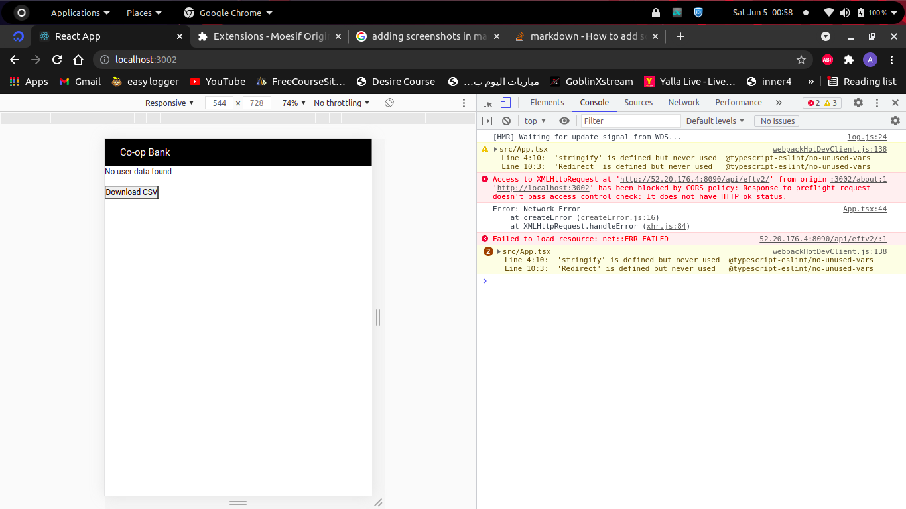
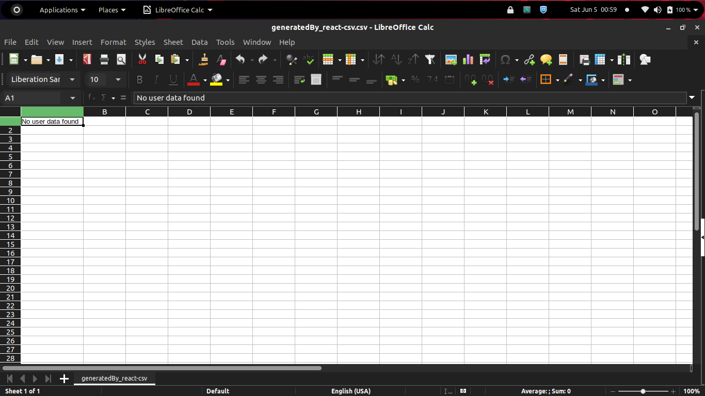
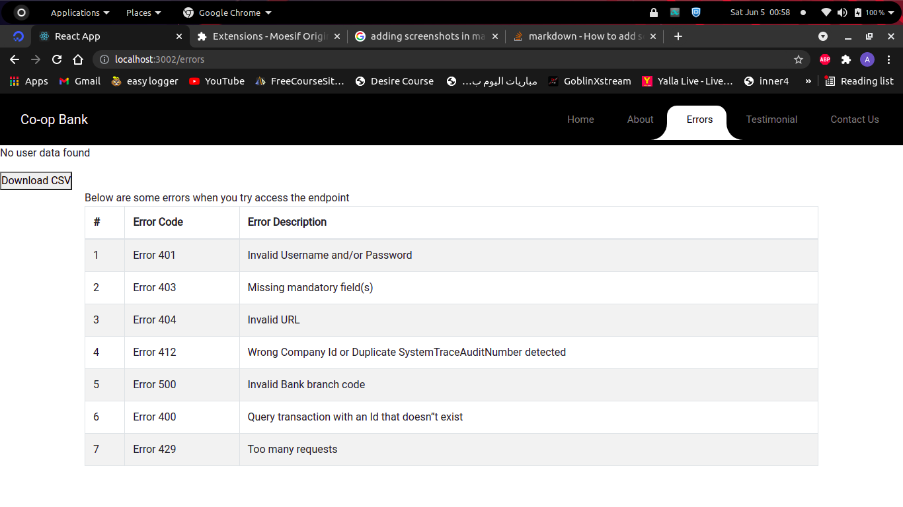

# Getting Started with Create React App

This project was bootstrapped with [Create React App](https://github.com/facebook/create-react-app).

## Available Scripts

In the project directory, you can run:

### `npm start`

Runs the app in the development mode.\
Open [http://localhost:3000](http://localhost:3000) to view it in the browser.

The page will reload if you make edits.\
You will also see any lint errors in the console.

### `npm test`

Launches the test runner in the interactive watch mode.\
See the section about [running tests](https://facebook.github.io/create-react-app/docs/running-tests) for more information.

### `npm run build`

Builds the app for production to the `build` folder.\
It correctly bundles React in production mode and optimizes the build for the best performance.

The build is minified and the filenames include the hashes.\
Your app is ready to be deployed!

See the section about [deployment](https://facebook.github.io/create-react-app/docs/deployment) for more information.

## Proof of Implementation

I implemented the solution using react and put the credentials given in the headers but I was getting
an error because The host servers do not allow access from http://localhost:3000 . I even installed Moesif Origin & CORS Changer browser extension to solve the problem but it didn't work.
Here is the screenshot:

## CSv
Here is the csv file that I was able to download after Implementation. Since my app couldn't access the endpoint it didn't download any data.

## Error Info Page
Here is a screenshot showing various errors:
